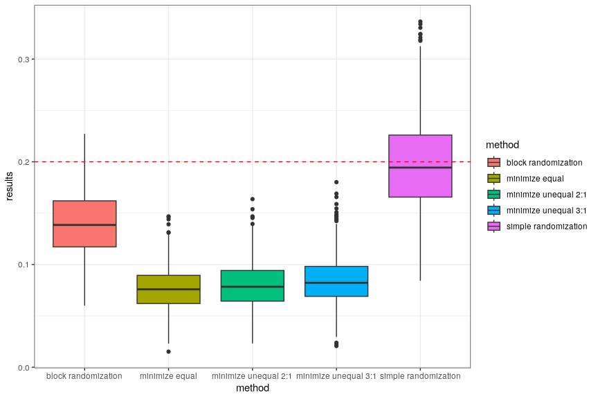

# **unbiased**: An R package for Clinical Trial Randomization

The challenge of allocating participants fairly and efficiently is a cornerstone for the success of clinical trials. Recognizing this critical need, we developed the **unbiased** package. This tool is designed to offer a comprehensive suite of randomization algorithms, suitable for a wide range of clinical trial designs.

## Why choose **unbiased**?

Our goal in creating **unbiased** was to provide a user-friendly yet powerful tool that addresses the nuanced demands of clinical trial randomization. It offers:

- **Ease of Integration**: Designed to fit effortlessly into your research workflow.
- **Adaptability**: Whether for small-scale studies or large, multi-center trials, **unbiased** scales to meet your needs.
- **Comprehensive Documentation**: To support you in applying the package effectively.

By choosing **unbiased**, you're adopting a sophisticated approach to trial randomization, ensuring fair and efficient participant allocation across your studies.

## Core features

The **unbiased** package integrates dynamic and traditional randomization methods, including:

- **Minimization Method**: For balanced allocation considering covariates.
- **Simple Randomization**: For straightforward, unbiased participant assignment.
- **Block Randomization**: To ensure equal group sizes throughout the trial.

Available both as a standard R package and through an API, **unbiased** provides flexibility for researchers. It ensures seamless integration with electronic Case Report Form (eCRF) systems, facilitating efficient patient management.

## Table of Contents

1. [Background](#background)
   - [Purpose and Scope for Clinical Trial Randomization](#purpose-and-scope-for-clinical-trial-randomization)
   - [Comparative Analysis of Randomization Methods](#comparative-analysis-of-randomization-methods)
   - [Comparison with Other Solutions](#comparison-with-other-solutions)
2. [Quickstart Guide](#quickstart-guide)
     - [Installation Instructions](#installation-instructions)
     - [Deploying the API](#deploying-the-api)
     - [API Configuration](#api-configuration)
3. [Getting started with **unbiased**](#getting-started-with-unbiased)
     - [Using Randomization Functions within R](#using-randomization-functions-within-r)
         - [Simple Randomization](#simple-randomization)
         - [Minimization Method](#minimization-method)
     - [API Endpoints](#api-endpoints)
        - [Study Creation](#study-creation)
        - [Patient Randomization](#patient-randomization)
4. [Technical Implementation](#technical-implementation)
   - [Quality Assurance Measures](#quality-assurance-measures)
   - [Running Tests](#running-tests)
     - [Executing Tests from an R Interactive Session](#executing-tests-from-an-r-interactive-session)
     - [Executing Tests from the Command Line](#executing-tests-from-the-command-line)
     - [Running Tests with Docker Compose](#running-tests-with-docker-compose)
   - [Code Coverage](#code-coverage)


# Background

## Purpose and Scope for Clinical Trial Randomization

Randomization is the gold standard for conducting clinical trials and a fundamental aspect of clinical trials, in studies comparing two or more arms. Although there are sometimes ethical constraints preventing the use of randomization, in most cases randomization is a desirable technique that will ensure that patients are randomly allocated to defined groups.

Randomization then ensures that the predictability of the allocation of consecutive patients to groups is blinded, allowing the study participants overseeing the clinical trial to be appropriately blinded. This is essential for maintaining the integrity of the trial and ensuring that the results are reliable. 

However, there are situations where it is desirable for studies to balance patients in terms of numbers in each group or, in addition, to achieve balance with respect to other relevant factors, such as sex or diabetes type.

Adequate selection of randomization methods allows the intended randomization goals to be realized; however, in the case of balance between groups in terms of patient characteristics, more adaptive methods of patient allocation are required, e.g. by verifying the overall imbalance on the basis of current allocations to the study groups. This is ensured, for example, by using the minimization method.

**Unbiased** specifically caters to the needs of clinical trial randomization. It streamlines the randomization process, ensuring a balanced and impartial allocation of participants across different trial groups, which is vital for minimizing bias and ensuring the reliability of trial outcomes. Unbiased allows the use of simple, block and advanced randomization methods relevant to the conduct of clinical trials. Consequently, it addresses the needs arising from the need to balance against key variables, ensuring that the population in each treatment group is as comparable as possible.

## Comparative Analysis of Randomization Methods

**Unbiased** compared to standard and most commonly used randomization methods, e.g. the simple method or the block method, additionally offers enhanced features of more flexible adaptive methods, which are based on current information about the allocation of patients in the trial. Compared to, for example, block randomization, adaptive randomization not only ensures relatively equal allocation to patient groups, but also allows the groups to be balanced on the basis of certain important covariates, which is its key advantage. This randomization requires predefined criteria, such as the probability with which a given patient will be assigned to a group based on minimizing the total imbalance, or weights that can be assigned personally for each individual covariate. Its advanced algorithmic approach sets it apart from others by minimizing selection bias and improving the overall efficiency of the randomization process in clinical trials.

The **unbiased** package offers the use of different randomization methods, each with its own strengths and limitations. The choice of randomization method will depend on the specific requirements of the trial, including the number of treatment groups, the size of the trial, and the need for stratification or covariate balance.

The **unbiased** package includes the following randomization methods:

- **Simple Randomization**: This is the most basic form of randomization, in which participants are assigned to treatment groups with equal probability. This method is simple and easy to implement. Since this is simple randomization, it does not take into account the initial covariates, and treatment assignment occurs randomly (flip coin method).

- **Minimization Method**: This method is designed to minimize imbalances in baseline characteristics between treatment groups. It uses an adaptive algorithm to assign participants to treatment groups based on their baseline characteristics, with the goal of achieving balance across treatment groups.

- **Block Randomization**: This method involves dividing participants into blocks and then randomly assigning them to treatment groups within each block. This ensures that the number of participants in each treatment group is balanced over time, but it does not account for any potential imbalances in baseline characteristics between treatment groups.

Depending on the aims and objectives of the randomised trial, the **unbiased** approach allows a choice of alternative methods to effectively implement appropriate algorithms for the randomized patient allocation process in a clinical trial. A comparison of these methods is shown in a boxplot, where a lower threshold value of the SMD index indicates a greater balance in covariates retained by the method.


...

To find out more, read our vignette on [Comparative Analysis of Randomization Methods](vignettes/minimization_randomization_comparison.Rmd).

## Comparison with other solutions

There are many packages that perform specific randomization methods in R. Most of them are designed for stratified randomization, and permuted blocks -e.g. blockrand, randomizeR. More recently, there have also been options for using minimization randomization - randpack, or minirand.

Unlike the other packages, unbiased incorporates several different types of minimization algorithms - from simple simple randomization methods to advanced ones based on the Pocok minimization method. In addition, the advantage of using unbiased is that it can be used in the form of an API, which is not possible in the existing software, making **unbiased** appear complete from the point of view of usability, as well as the possibility of testing multiple methods for an individual study within a single package.

# Quickstart Guide

Initiating your work with **unbiased** involves simple setup steps. Whether you're integrating it into your R environment or deploying its API, we aim to equip you with a reliable tool that enhances the integrity and efficiency of your clinical trials.

## Installation instructions

The **unbiased** package can be installed from GitHub using the `devtools` package. To install **unbiased**, run the following command in your R environment:

```R
devtools::install_github("ttscience/unbiased")
```

## Deploying the API

Execute the API by calling the`run_unbiased()` function:
```R
unbiased::run_unbiased()
```
After running this command, the API should be up and running, as default listening on a port on your localhost (http://localhost:3838). You can interact with the API using any HTTP client, such as curl in the command line, Postman, or directly from R using packages like httr.

## API configuration

The **unbiased** API server can be configured using environment variables. The following environment variables need to be set for the server to start:

- `POSTGRES_DB`: The name of the PostgreSQL database to connect to.
- `POSTGRES_HOST`: The host of the PostgreSQL database. This could be a hostname, such as `localhost` or `database.example.com`, or an IP address.
- `POSTGRES_PORT`: The port on which the PostgreSQL database is listening. Defaults to `5432` if not provided.
- `POSTGRES_USER`: The username for authentication with the PostgreSQL database.
- `POSTGRES_PASSWORD`: The password for authentication with the PostgreSQL database.
- `UNBIASED_HOST`: The host on which the API will run. Defaults to `0.0.0.0` if not provided.
- `UNBIASED_PORT`: The port on which the API will listen. Defaults to `3838` if not provided.

# Getting started with **unbiased**

The **unbiased** package offers functions for randomizing participants in clinical trials, ensuring a fair and transparent process.

### Simple Randomization

Use `simple_randomization` for uncomplicated, unbiased assignment, giving each participant an equal chance of being allocated to any group. This method requires specifying the `arms` and `ratio` parameters, where `arms` is a vector of treatment group names, and `ratio` is a vector of integers indicating the allocation proportions.

```R
# Treatment group assignments with a 1:1 ratio
treatment_group <-
  randomize_simple(
    arms = c("treatment", "placebo"),
    ratio = c("treatment" = 1, "placebo" = 1)
  )
```

*Note: Ensure that the `ratio` parameter accurately reflects an allocation proportion vector, using numeric values to denote the proportions.*

### Minimization Method

The minimization method considers existing participant assignments to minimize bias. New participants are allocated based on an imbalance score, calculated using specified weights for each covariate. This method dynamically adjusts to maintain balance across treatment groups.

```R
# Treatment group assignment considering previous participants' data
treatment_group <- randomize_minimisation_pocock(
  arms = c("treatment", "placebo"),
  current_state = previous_data,
  weights = c(
    "sex" = 1,
    "age" = 1
  ),
  ratio = c(1, 1), # Ensure ratio is defined correctly
  method = "var",
  p = 0.85
)
```

## API Endpoints

The **unbiased** API facilitates randomization and clinical trial management via HTTP clients.

### Study Creation

To initialize a study using Pocock's minimization method, use the POST /minimisation_pocock endpoint. The required JSON payload should detail the study, including treatment groups, allocation ratios, and covariates.

```R
# Initialize a study with Pocock's minimisation method
response <- request(api_url) |>
    req_url_path("study", "minimisation_pocock") |>
    req_method("POST") |>
    req_body_json(
      data = list(
        identifier = "My_study_1",
        name = "Study 1",
        method = "var",
        p = 0.85,
        arms = list(
          "placebo" = 1,
          "treatment" = 1
        ),
        covariates = list(
          sex = list(
            weight = 1,
            levels = c("female", "male")
          ),
          age = list(
            weight = 1,
            levels = c("up to 50", "51 or more")
          )
        )
      )
    )
```

This call sets up the study and returns an ID for accessing further study-related endpoints.

### Patient Randomization

The POST /{study_id}/patient endpoint assigns a new patient to a treatment group, requiring patient details and covariate information in the JSON payload.

```R
# Randomize a new patient
req_url_path("study", my_study_id, "patient") |>
          req_method("POST") |>
          req_body_json(
            data = list(
              current_state =
                tibble::tibble(
                  "sex" = c("female"),
                  "age" = c("up to 50"),
                  "arm" = c("") 
                )
            )
          )
```

This endpoint determines the patient's treatment group.

# Technical details

## Running Tests

Unbiased provides an extensive collection of tests to ensure correct functionality.

### Executing Tests from an R Interactive Session

To execute tests using an interactive R session, run the following commands:

```R
devtools::load_all()
testthat::test_package(**unbiased**)
```

Make sure that `devtools` package is installed in your environment.

Ensure that the necessary database connection environment variables are set before running these tests. You can set environment variables using methods such as `Sys.setenv`.

Running these tests will start the Unbiased API on a random port.

### Executing Tests from the Command Line

Use the helper script `run_tests.sh` to execute tests from the command line. Remember to set the database connection environment variables before running the tests.

### Running Tests with Docker Compose

Docker Compose can be used to build the Unbiased Docker image and execute all tests. This can be done using the provided `docker-compose.test.yml` file. This method ensures a consistent testing environment and simplifies the setup process.

```bash
docker compose -f docker-compose.test.yml build
docker compose -f docker-compose.test.yml run tests
```

### Code Coverage

Unbiased supports code coverage analysis through the `covr` package. This allows you to measure the effectiveness of your tests by showing which parts of your R code in the `R` directory are actually being tested.

To calculate code coverage, you will need to install the `covr` package. Once installed, you can use the following methods:

- `covr::report()`: This method runs all tests and generates a detailed coverage report in HTML format.
- `covr::package_coverage()`: This method provides a simpler, text-based code coverage report.

Alternatively, you can use the provided `run_tests_with_coverage.sh` script to run Unbiased tests with code coverage.
